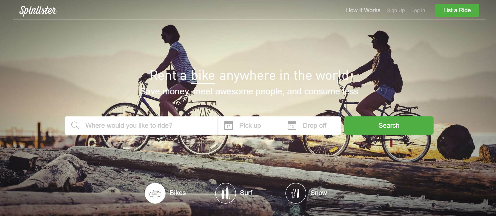

# Renda Extra: ideias para ganhar dinheiro extra agora

No capítulo anterior mostrei algumas opções para trabalhar exclusivamente online.

Já aqui neste capítulo, vou mostrar algumas opções para você ganhar dinheiro da forma mais imediata o possível - sendo online ou não. 

Ideias para ganhar dinheiro extra não surgem de primeira, mas uma rápida pesquisa no Google pode te revelar saídas bem simples e criativas.

Junto com o pacote – infelizmente – você também verá um tanto de fraudes, sites de soluções milagrosas, correntes, esquemas de pirâmide… enfim. Mas não desanima!

Pra te facilitar a vida, vou te mostrar 6 ideias para gerar renda extra:

[[toc]]

## Renda Extra #1: Desapega! Venda o que você não usa.

O “enjoei” tem um visual bem bacaninha e dá pra vender altas coisas

Já pensou em vender alguma coisa que você não usa? Tem mercado pra tudo! Sites como **[Mercado Livre](http://www.mercadolivre.com.br/)**, **[OLX](http://www.olx.com.br/)** e **[Enjoei](https://www.enjoei.com.br/)** são exemplos de lugares onde você pode fazer isso, seja pelo computador ou mesmo pelo celular. Aquela traquitana ou roupa que você não usa pode ter bastante valor para alguém!

## Renda Extra #2: Alugue suas coisas

E que tal aproveitar a onda da economia colaborativa? Se você não quer se desfazer de um objeto, talvez você possa emprestá-lo e ser remunerado por isso. Em sites como o **[Spinlister](https://pt.spinlister.com/)** você pode colocar sua bike ou prancha de surf para aluguel. No **[Armário Compartilhado](http://www.armariocompartilhado.com.br/compartilhe)** você pode alugar vestidos.

## Renda Extra #3: Dê carona

Aplicativos como Uber e 99 são ótimos para corridas dentro de uma mesma cidade. Mas, se você for pegar a estrada, o **[blablacar](https://www.blablacar.com.br/offer-seats/1)** é uma boa opção. Você preenche o seu perfil, anuncia o seu trajeto, número de assentos livres, e começa a receber contatos de passageiros interessados. E é claro, recebe pela carona.

## Renda Extra #4: Cuide de Pets

Se você ama animais – e tem tempo para cuidar deles -, sites como o **[DogHero](https://www.doghero.com.br/)** podem te recompensar por cuidar dos cães enquanto os donos viajam, ou mesmo apenas passear com eles. A tarefa parece fácil, mas é um baita compromisso! Afinal de contas, você cuidará do quase-filho de alguém.

## Renda Extra #5: Hospede um gringo

Já no **[Airbnb](http://www.airbnb.com.br/r/lerenos2)**, você pode alugar um quartinho na sua casa e ganhar um troco hospedando viajantes (muitos gringos usam!). É possível também alugar o apartamento inteiro (por exemplo, se você for viajar ou ficar um tempo na casa de alguém). O site é bem fácil de usar e você pode bloquear as datas que não quiser disponibilizar para aluguel.

Considere fazer um investimento para deixar o quarto/apartamento bem legal e confortável. A sua reputação como anfitrião conta muito no site!

## Renda Extra #6: Preste um serviço

Você tem alguma aptidão que possa transformar em serviço? Sabe consertar uma tomada? Encanamento? Fotógrafo? Instala a impressora pra vovó?

Esse é um jeito bem interessante de flexibilizar a sua renda. É como se fosse um segundo emprego: só que você trabalha quando quiser, e recebe por serviço. 

Sites como **[GetNinjas](https://www.getninjas.com.br/)**, **[Freelancer.com](https://www.br.freelancer.com/)**, **[Trampos.co](http://trampos.co/)**, **[99freelas](https://www.99freelas.com.br/)** e **[Upwork](https://www.upwork.com/)** podem te ajudar na missão de divulgar esse seu serviço extra.

## Para fechar

As opções acima podem dar uma boa aliviada na crise ou, até mesmo, fazer com que você descubra novos rumos na sua vida. A evolução tecnológica de nossos tempos é impressionante, e o leque de oportunidades pra que você aproveite seus talentos (e encontre gente interessada em pagar por eles) só cresce!