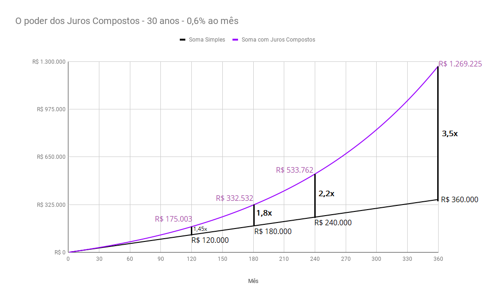

# #9 Sete Conceitos Fundamentais das Finanças Pessoais

Finge que a sua vida financeira é um jogo.

Você tem que conquistar **[aqueles 2 objetivos descritos no primeiro capítulo](/guia/inicio/1-os-2-objetivos-principais-das-financas-pessoais.html)**: independência financeira e vencer as emergências no meio do caminho.

Como em qualquer jogo, você tem que fazer movimentos, tomar **ações concretas** pra vencer, que é o que eu falo no capítulo seguinte.

Esse vídeo aqui é o vídeo das regras do jogo. Não somente regras, mas também algumas dicas pra você jogar melhor.

Você precisa saber dessas regras? Vou te ser sincero:

não.

Você pode entrar no jogo e sair chutando (que é o que normalmente fazemos).

Mas se você souber desses 7 conceitos básicos que eu vou te passar agora, teu jogo vai ficar muuuito mais fácil.

E agora, gastando apenas poucos minutos, você vai saber quais são os 7 principais conceitos de finanças pessoais. Vamos lá:

## As 7 regras do jogo – ou 7 conceitos fundamentais das finanças pessoais – são:

1. Juros Compostos - O poder do tempo e do hábito
2. Risco x Retorno
3. Desviar de Fraudes
4. Ter coragem de começar pequeno usando o que pode
5. Alavancagem: Saber quando um empréstimo é saudável
6. Foco nos Objetivos
7. Problemas ignorados ficam mais caros

## #1. Juros Compostos - O poder do tempo e do hábito

**O tempo é extremamente poderoso.** Com tudo.

Se você se exercitar e se alimentar bem apenas um dia, o que mudará em sua vida? Praticamente nada, talvez só cansaço.

Mas e se você fizer isso **todo dia**, durante **um ano**? Com certeza haverá uma GRANDE mudança.

E se você fumar cigarro um dia da sua vida? E se o hábito persistir por 30 anos?

Com a construção do seu patrimônio é a mesma coisa. No começo, parece que não vai dar em nada. Não desista. Os juros compostos são IMBATÍVEIS. Quanto mais a sua riqueza cresce, mais ela crescerá.

O efeito dos juros compostos só é melhor observado depois de muitos anos, coisa de mais de uma década. Dá uma olhada nesse gráfico:

Na linha preta reta, você vê o que acontece se você simplesmente juntar dinheiro, R$1.000 por mês durante 30 anos.

Na linha roxa, você vê o poder dos juros compostos. Os ganhos são **exponenciais**. Seu dinheiro começa a render em cima dos rendimentos anteriores.

**É dinheiro fazendo dinheiro!**

Em resumo: o tempo e os juros compostos são muito poderosos, mas só se você tiver **paciência** de poupar periodicamente – todo mês ou toda semana – e tornar isso um **hábito** por muitos e muitos anos.

Se você tiver essa disciplina, o prêmio é GRANDE.

Agora imagina o que acontece se você estiver do lado inverso: ou seja, entrar num financiamento de longo prazo? Aí toda essa força vai agir contra você. É mais difícil remar contra a maré.

## #2. Risco versus Retorno

Vou dar 3 frases populares – coisa simples – pra você entender a relação entre risco e retorno:

- Quem não arrisca, não petisca
- Nunca coloque todos os ovos no mesmo cesto
- E quando a esmola é demais… o santo desconfia

Se você entendeu essas 3 frases, então você já entendeu quase tudo que precisa sobre esse assunto. 

Essa é a relação mais básica que todo investidor, por menor que seja, **tem a obrigação de saber:**

:::: info Risco x Retorno:
:::center
**Quanto maior o retorno que você espera, maior o risco que você terá de correr.**

ou

**Quanto menor o risco que você corre, menor o retorno que você pode esperar.**
:::
::::

**Retorno** é o quanto você ganha num investimento.

Ex.: Investiu R$100 e resgatou R$200 = O retorno foi de R$100.

**Risco** é uma medida de incerteza. Um investimento tem risco elevado quando você tem muita incerteza sobre onde o preço dele vai parar. O risco é baixo quando o pagamento é previsível.

Para correr mais riscos de forma consciente, você tem que tomar pelo menos uns minutinhos para pesquisar e entender no que você tá entrando.

É recomendável misturar investimentos de *níveis de risco diferentes* para *balancear* a sua carteira de investimentos. 

## #3. Desviar de Fraudes

[Já comentamos no capítulo #7](/guia/inicio/7-fraudes-como-nao-cair-em-ciladas-e-perder-dinheiro-de-bobeira.html), mas vale a pena resumir e reforçar:

As pessoas caem em fraudes geralmente por dois fatores:

- desespero
- e desconhecer a relação risco x retorno, especialmente a terceira frase que eu falei ali: “quando a esmola é demais, o santo desconfia”.

Ressalto aqui então duas fraudes:

### 3.1. O golpe do empréstimo com depósito adiantado

Nunca pague depósito adiantado para liberar um empréstimo! É FRAUDE!

### 3.2 Pirâmides

São aquelas propostas mirabolantes de investimento prometendo **altíssimos retornos** em **pouco tempo** com **quase nada de risco**, e que incentivam que você traga os seus amigos pra que você monte sua rede e ganhe mais.

## **#4. Coragem de começar pequeno usando o que pode**

E então você aprende, e cresce.

Esse pensamento é uma das bases para você empreender, começar uma atividade que te dê renda extra e que vire seu próprio negócio.

Mas isso também se aplica perfeitamente a começar a investir para o longo prazo, para formar seu patrimônio.

Nos investimentos, você não vai – e nem precisa – começar sabendo de tudo.

Muita coisa você vai aprendendo ao longo do caminho: e pra isso, é claro, você tem que dar o primeiro passo.

É um ciclo:

Arriscar o que pode, aprender e crescer, arriscar o que pode, aprender e crescer... 

Só que é um ciclo crescente, pois você sempre estará subindo um degrau no seu aprendizado e, se tudo der certo, na sua acumulação de patrimônio.

## #5. Alavancagem: Saber quando um empréstimo vale a pena

Já explicado no [capítulo #6 - Crédito](/guia/inicio/6-credito-alavanca-ou-bola-de-neve-como-nao-cair-em-armadilha.htm), mas aproveito para relembrar os 4 casos:

1. Alavancar um projeto produtivo: Por exemplo, você é um microempreendedor e vai pegar um microcrédito pra ampliar o seu negócio.

2. Financiar o aumento da sua produtividade: Por exemplo, financiar os seus estudos, ou comprar um celular melhor que te ajude a trabalhar e ganhar mais dinheiro.

3. Evitar ou quitar dívidas mais caras: Por exemplo, pegar um empréstimo com fgts em garantia para quitar a dívida do cheque especial.

4. Quarto e último caso, o mais grave de todos: um empréstimo de emergência - que vai acontecer se você não tiver feito uma reserva para emergências.

## #6. Foco nos Objetivos

As ferramentas estão sempre mudando, então você não deve se apegar a elas. 

Sempre que estiver fazendo alguma coisa e sentir que está se perdendo, se pergunte: 

- Por que estou fazendo isso?
- Por que estou gastando tempo ou dinheiro com isso?
- Vale a pena estressar com isso?

Se não houver boa resposta para essas perguntas, corte da sua vida.

## #7. Problemas ignorados ficam mais caros

Isso é bem conectado com um viés cognitivo chamado **Efeito Avestruz**: a tendência de ignorar informações ruins. Se é desconfortável, a gente finge que não viu e tenta deixar para depois.

É uma falha natural da mente da maioria das pessoas. É uma atitude inconsciente.

O problema aqui é que problemas - quando ignorados - crescem.

Especialmente no âmbito das finanças, as mentiras e negações da realidade vão fazer com que você gaste mais do que pode, com que você tenha clientes insatisfeitos, ou que você trabalhe em coisas que não te trazem felicidade e nem dinheiro.

Gosto sempre de colocar alguma frase popular para ilustrar conceitos econômicos, então a que eu escolho para este ponto é:

:::: warning Lembrete:
::: center
**Só se conserta telhado em dia de sol.**
:::
::::

Se você tiver algum problema (que realmente for um problema que você precisa resolver), é melhor consertar antes do que deixar para depois.

## Hora da Ação

No próximo capítulo você verá um desafio prático para sair da teoria e entrar em ação.