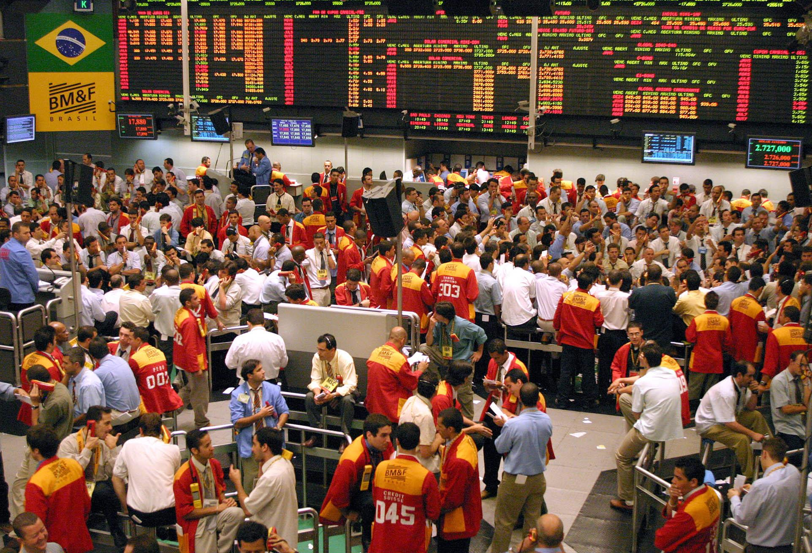
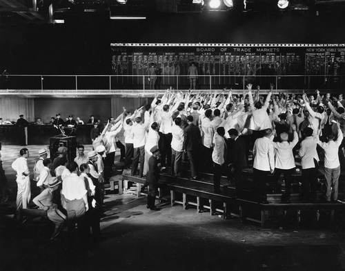
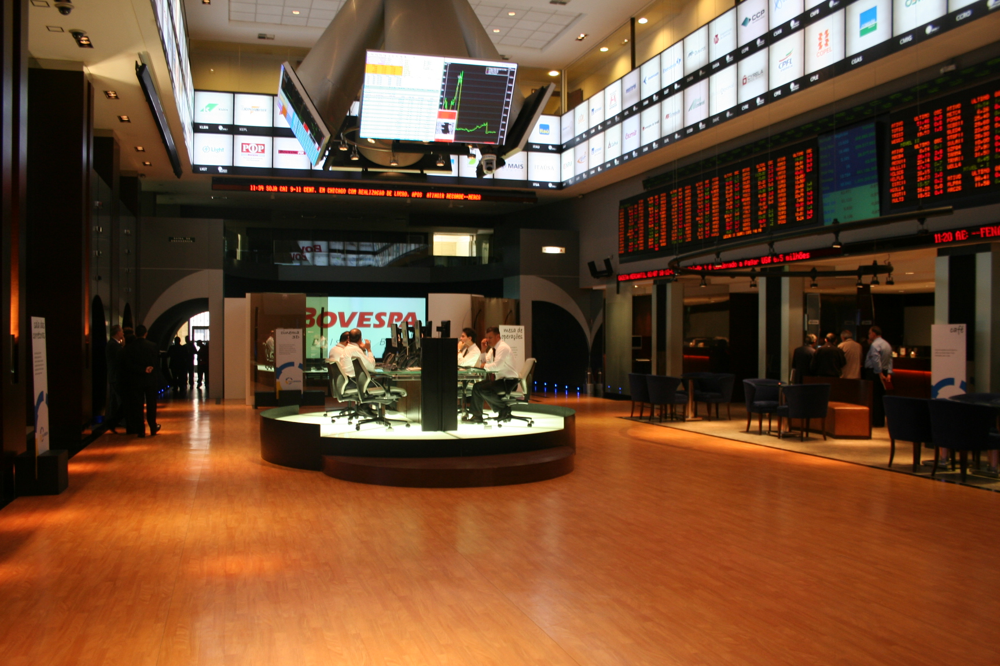

# O que é a Bolsa de Valores?

*Um “pregão” da bolsa de valores, em 2004.*

A bolsa de valores é o lugar onde compradores e vendedores de ações se encontram para fazer negócios. É igual uma feira. É só substituir o feirante por um vendedor, e o chuchu por uma ação.

Aqui no Brasil, o nome dessa feira é a **B3** – a antiga bolsa de valores de São Paulo.

Antigamente era tudo mais parecido com uma feira mesmo. Um monte de gente gritando, aquela bagunça. Se você tiver curiosidade, **[veja essa série imagens antigas da bolsa de valores de Nova York (post em inglês)](http://www.businessinsider.com/old-wall-street-trading-technology-2014-9?op=1)**.

Hoje em dia, ninguém tem que ir lá na bolsa para comprar ou vender ações. É tudo pelo computador!

A B3, em São Paulo: hoje em dia o pregão é todo eletrônico, e o salão é quieto que só… (você pode ir lá visitar e tomar um café, por exemplo)

:::tip Curiosidade
A B3 é uma empresa privada que também tem capital aberto na própria bolsa. O ticker da ação é B3SA3.
:::

Só que não dá pra entrar sozinho nesse mercado. Não dá pra acessar a bolsa sozinho. Você precisa de alguém que faça as compras e vendas por você: a **Corretora de Valores**.

E esse é o assunto do próximo capítulo. Nele vou te dar algumas opções de corretoras onde você pode abrir conta: e sem pagar nada por isso!