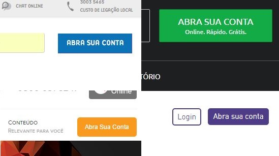

# Por onde investir? Banco? Corretora? Qual corretora escolher?

No capítulo anterior falei sobre onde todas as compras e vendas do mercado acontecem: a bolsa de valores (B3).

E lá mencionei que você não consegue acessar diretamente a bolsa: você precisa de uma corretora de valores.

E agora chegou a hora de você abrir a conta numa corretora!

## Corretora de Valores

:::tip Corretora de Valores
Uma corretora de valores é uma instituição financeira – tipo um banco – que só serve para **uma coisa**: fazer você conseguir investir.

:::

Todos os investidores **obrigatoriamente** se comunicam com as corretoras, que são responsáveis por fazer o meio de campo entre você e o resto do mercado. E por esse serviço, elas ganham uma **taxa de corretagem**.

Existem atualmente [102 corretoras](https://www.b3.com.br/pt_br/produtos-e-servicos/participantes/busca-de-participantes/participantes/), e essas taxas de corretagem variam bastante. Em muitas, inclusive, a taxa de corretagem é **zero**!

Serve não só para ações e ETFs, mas também para diversos outros investimentos, como o Tesouro Direto, CDBs e Debêntures.

## **E por que não investir direto pelo meu banco?**

E é claro que os grandes bancos (Banco do Brasil, Itaú, Bradesco) também têm suas corretoras, mas elas costumam ser mais caras.

É só isso. Preço. Muitas corretoras têm uma interface e atendimento muito melhor do que os bancos, sem cobrar nada por isso. Logo, em geral, não faz sentido investir por meio da corretora do seu banco.

## Corretoras com Taxa Zero

Hoje em dia, muitas corretoras excelentes cobram **taxa zero** para vários serviços. Abaixo listei algumas corretoras que não cobram nada nos seguintes serviços:

- abertura de conta
- custódia
- tesouro direto
- corretagem de ações, ETFs e FIIs

São elas:

- [Genial Investimentos](https://www.genialinvestimentos.com.br/)
- [Nuinvest](https://www.nuinvest.com.br/taxas-e-precos.html)
- [Clear](https://corretora.clear.com.br/custos/)

Recomendo que você abra conta em alguma dessas acima.

## Outas corretoras famosas

Existem ainda outras corretoras famosas no mercado que cobram algumas taxas. Vou colocar os links aqui mais para você ter uma noção:

- [XP](https://www.xpi.com.br/custos-operacionais/) (taxa de corretagem de R$ 4,90 para ações)
- [Modalmais](https://www.modalmais.com.br/)
- [Órama](https://www.orama.com.br/)
- [Ágora](https://www.agorainvestimentos.com.br/)
- [Elite Investimentos](https://eliteinvestimentos.com.br/)

## Taxa Zero? Então como elas ganham dinheiro?

Essas corretoras ganham dinheiro distribuindo fundos de investimento, vendendo cursos, operando mecanismos de provimento de liquidez ao mercado, ou te oferecendo uma renda fixa e colocando uma diferença embutida no rendimento (que a gente chama de *spread*).

Então não tem pegadinha, realmente a taxa é zero, e as corretoras acabaram achando seu caminho de ganhar dinheiro de outras maneiras.

## Mas tem os Impostos

É, disso aí ninguém se livra. A cada compra e venda de ações você faz, você vai pagar alguma merreca de imposto e de taxas operacionais. Mas isso não altera sua decisão por corretoras e nem muda o fato de que você precisa investir.

Como isso simplesmente não altera a sua decisão financeira, apenas não se preocupe com isso. Aceite o fato de que você sempre paga imposto.

Mas vou listar aqui as principais:

- [Tarifas operacionais da B3 para ações e ETFs](https://www.b3.com.br/pt_br/produtos-e-servicos/tarifas/listados-a-vista-e-derivativos/renda-variavel/tarifas-de-acoes-e-fundos-de-investimento/a-vista/): 0,03% sobre o valor da operação. Eu avisei, é uma merreca.
- [Imposto de Renda sobre ganho de capital em renda variável](https://www.nuinvest.com.br/tributacao-de-renda-variavel.html): 15% do lucro, se o valor das vendas no mês exceder R$ 20.000; e 20%, se for *day trade* (que eu espero que você não faça).

Novamente: mesmo pagando imposto, é melhor investir do que simplesmente ficar parado ou largar na poupança.

Falando nisso, é hora de abrir a conta!

## Passo #1 – Abra uma conta

É tudo online e de graça. Sempre tem um botão colorido lá no canto direito do site da sua corretora.

Você vai preencher um cadastro e geralmente no mesmo dia a conta tá aberta. Você vai receber todos os dados de depósito e de login num e-mail de boas vindas.

Mas se der alguma confusão com os documentos, eles vão te avisar. Então fica atento no seu e-mail, que no mesmo dia costuma rolar alguma informação

E vai ter também a sua assinatura eletrônica – essa daí é a senha usada para confirmar as operações de compra e venda dentro da corretora. Guarde essas coisas num local seguro (de preferência, a sua própria cabeça mesmo).

## Passo #2 - Deposite dinheiro

Para investir, você tem que transferir dinheiro do seu banco para a sua corretora. 

É só fazer um TED ou PIX para a conta indicada pela corretora. Você recebe todas essas instruções no e-mail de boas vindas e ao fazer login no site da corretora.

:::warning
Importante! A transferência tem que vir de uma conta da sua titularidade. Se vier de outro CPF, ela vai voltar.
:::

E da mesma forma, pra tirar o dinheiro da corretora, ele só pode ir para uma conta sua. Então é super seguro!

Aproveita e já deixa as próximas transferências agendadas para os próximos meses! Automatizar o processo de poupança é um dos maiores truques para conseguir manter o hábito de poupar!

## **Pô, mas eu pago TED pra transferir…**

Sai dessa!! É muito importante você ter uma conta digital pra evitar esse gasto, se não seu dinheiro vai ser comido por taxas.

Qualquer conta digital hoje em dia te permite fazer transferências gratuitas.

Exemplos:

- Nuconta
- Picpay
- PagBank

Se você está acompanhando este guia desde o início, com certeza você já tem conta em alguma delas para juntar para a sua reserva de emergências.

Se você ainda não viu, então por favor volte lá no post sobre a reserva de emergências!

## Conclusão

Você agora tem a ferramenta necessária para começar a investir para a independência financeira! Parabéns! 🎉

Teve alguma dificuldade? Entre em contato com a corretora, eles vão te ajudar!

Tem alguma dica? Comenta aqui!

Na próxima seção você vai entender sobre as estratégias de investimento para a Independência Financeira e sobre onde investir na prática.