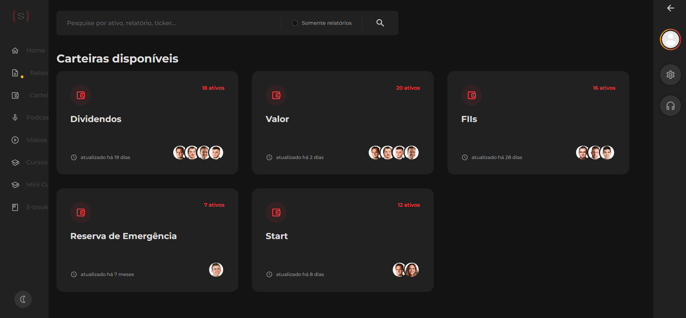

# Onde Investir com R$ 1.000, 10.000 ou 100 mil reais? (1 milhão?)

No vídeo de hoje eu vou responder a maior dúvida do mundo dos investimentos:

**Onde colocar o seu dinheiro?**

Onde investir com apenas R$100 reais? E mil? 10 mil? 20 ? 50? E por que não 1 milhão?

Bom, bora lá!

# Onde investir até R$ 100?

Se você está iniciando no mundo dos investimentos e está começando com apenas 100 reais ou menos, então primeiro de tudo:

:::center
**PARABÉNS!!** 🎉
:::

O primeiro passo é o passo mais difícil de todos. O desafio agora é **manter** e **continuar poupando todo mês**.

Segunda coisa:

**Nuconta.**

Abre uma Nuconta e vai colocando o seu dinheiro lá. Simples assim. Rende merrecas mas já rende mais do que a poupança. A gente tem vídeo falando sobre ela e sobre a sua reserva para emergências nas próximas aulas.

# Onde investir de R$ 100 até R$ 10.000?

Nuconta de novo!

Infelizmente ninguém tá me pagando para fazer essa propaganda haha

É porque é boa mesmo, inclusive eu uso. Mas há ainda outras opções muito legais no mercado, tais como:

- Picpay
- MercadoPago
- Neon

A racionalidade aqui é a seguinte: até R$10.000 você provavelmente ainda tá fazendo a sua Reserva para Emergências.

Então você precisa colocar seu dinheiro num lugar:

1. seguro
2. rápido de resgatar (que é a tal da alta liquidez)
3. e que renda no mínimo 100% do CDI

E as principais carteiras digitais atendem esses pre-requisitos com facilidade e segurança.

O Tesouro SELIC também é uma alternativa super válida, que rende aproximadamente a mesma coisa, mas como a interface é um pouco mais complicada do que a das carteiras digitais, não vou nem mencionar aqui.

## Onde investir de R$ 10.000 até R$ 50.000?

Mais de R$ 10 mil reais? Agora sim a gente consegue finalmente falar de investimentos um pouco mais complexos.

De 10 até uns 50 mil, é hora de começar a formar a sua carteira de ações mirando no longo prazo.

Você vai continuar com sua reserva de emergências em Nuconta, Tesouro SELIC, Picpay, o que for.

Mas agora você já vai ter dinheiro para comprar **o seu primeiro lote de ações ou ETFs.**

E não tem nada a ver com trade, ficar comprando e vendendo vidradão no mercado…

O que eu estou falando aqui é de **ser sócio de grandes empresas**, em acompanhar o que acontece dentro delas e de **crescer no longo prazo.**

Você vai aprender mais sobre esse assunto na seção **[Renda Variável – Ações]()**, que te explica como comprar a sua primeira ação e as coisas que você tem que ficar de olho.

Mas todo esse papo naturalmente puxa outra pergunta:

## Que empresas escolher?

Existem muitas empresas legais que você pode comprar tanto na bolsa brasileira quanto na bolsa americana. Exemplos:

### Empresas na Bolsa Brasileira

Energia Elétrica - ENBR3, EGIE3, CPLE6, COCE5, TAEE11

Seguros - SULA11, BBSE3

Consumo - ABEV3, NATU3

Industrial - VALE3, WEGE3

Telefonia - VIVT3, TIMS3

### Empresas na Bolsa Americana

Tecnologia - GOOG, AAPL, FB, AMZN

Streamming - DIS, NFLX

China - BABA

Caanabis (ETFs) - MJ, YOLO, MSOS

### ETFs - Exchange Traded Funds

Exchange Traded Funds = Fundos negociados em Bolsa

Você consegue também investir em Fundos de Investimento, que empacotam juntas diversos desses investimentos. Exemplos:

- IVVB11 (ou IVV nos EUA) - S&P500, índice das 500 maiores ações dos estados unidos
- BOVA11 - Ibovespa, Índice das maiores empresas brasileiras
- HASH11 - Índice de Criptomoedas

E não se preocupe se você não entende esses nomes, nos próximos capítulos vou te explicar tudo.

Muito legal, mas na prática…

## Como decidir o que comprar?

Existe um tipo de carreira no mercado financeiro que se destina apenas a tentar responder a essa pergunta. Essa carreira é do **Analista de Investimentos.**

O trabalho desse analista se baseia em acompanhar o balanço das empresas, ver o que elas estão fazendo, analisar o máximo de coisas possível para **chegar num preço justo,** o preço que seja interessante para você comprar aquela ação e continuar com ela por muito tempo, recebendo dividendos.

Em geral esses analistas trabalham juntos em empresas especializadas em emitir essas recomendações, que nós chamamos de **Casas de Análise**.

Todo grande banco e corretora de valores acaba tendo um departamento de análise de investimentos, mas hoje em dia também existem diversas casas de análise independente. Exemplos:

- [Suno Research](https://www.suno.com.br/)
- [Empiricus](https://www.empiricus.com.br/)
- [Eleven](https://elevenfinancial.com/)
- [Nord](https://www.nordresearch.com.br/)
- [Spiti](https://invistaspiti.com.br/)
- [Mercurius Crypto](https://mercuriuscrypto.com/)

Essas empresas emitem relatórios de análise e **carteiras recomendadas**. Você paga um valor mensal para ter acesso às recomendações. O valor varia bastante, mas é razoável pensar num valor de R$ 40/mês para ter acesso a carteiras recomendadas de ações de empresas brasileiras.

Painel de Carteiras de uma Casa de Análise

Mas no fim das contas, a decisão é sempre sua. Leia os relatórios de análise, leia outras fontes de informação, mas é importante que, depois de comprar uma ação, **você esteja feliz em possuí-la e que você acredite naquilo que a empresa vende.**

E é claro que para tomar decisões conscientes, você deve conhecer mais dos conceitos básicos de finanças - que é exatamente o motivo pelo qual você está lendo esse Guia de Finanças Pessoais.

Continuemos:

## Onde investir de R$ 50.000 a R$100.000?

Você vai continuar investindo em ações.

Mas começam a aparecer alguns produtos interessantes para diversificar a sua carteira, e você vai podendo adicionar mais componentes de **risco**.

Alguns exemplos:

- Renda Fixa não garantida pelo FGC (Precatórios, Debêntures)
- Criptomoedas

## Onde investir de R$ 100.000 a R$ 1 milhão?

Começa a ficar interessante ter apoio especializado, por meio de

- planejadores financeiros
- assessores de investimentos
- gestoras de recursos

Mas no fim das contas, é muito importante, desde o início, ter em mente uma filosofia de investimentos muito clara, de modo a conseguir discernir o que está sendo investido para o curto prazo e o que está sendo investido para você ganhar no longo prazo.

Mas para que tanto pensamento de longo prazo, se a vida é agora?

Bom, a resposta para isso é o que vem na próxima pergunta:

## E o que fazer com R$ 1 milhão?

Simples: se você quiser, você pode **viver de renda!**

Eu também explico nisso na seção de Independência Financeira, especialmente no capítulo sobre Fundos de Investimento Imobiliário (FII).

Os FIIs são um instrumento muito interessante para viver de renda.

## Trago aqui um exemplo com números

R$ 1 milhão aplicado numa carteira de FIIs te dá cerca de R$ 6 ou 7 mil reais de rendimento, todo mês.

De forma resumida, quando você compra um FII, você está comprando um pedacinho de imóveis: como shopping centers, galpões logísticos, prédios comerciais. E por isso, você receberá parte dos aluguéis desses imóveis, todo mês.

Assim, esse é um instrumento perfeito para quem quer viver de renda.

E é por isso que é tão interessante **mirar no longo prazo**, juntar um grande valor e conseguir atingir a sua independência financeira.

## Você acabou de investir seu tempo em educação

Na próxima seção você continuará a aprender sobre os conceitos fundamentais de investimentos, que vão te dar mais autonomia para entender, pesquisar e conversar sobre o assunto (tanto com leigos, quanto com especialistas).