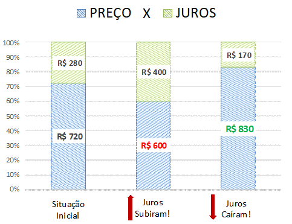
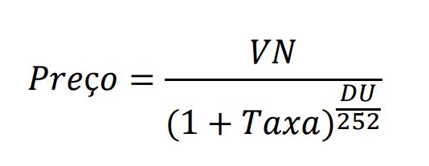
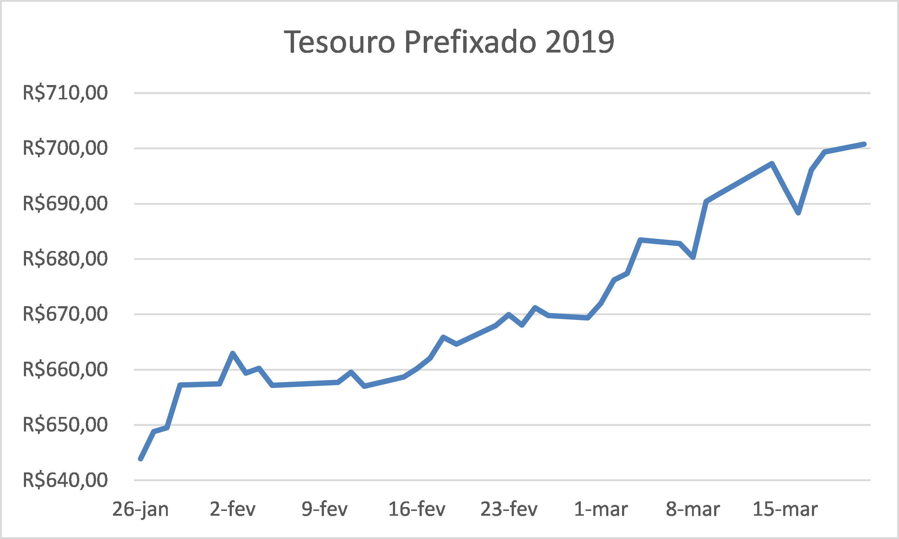
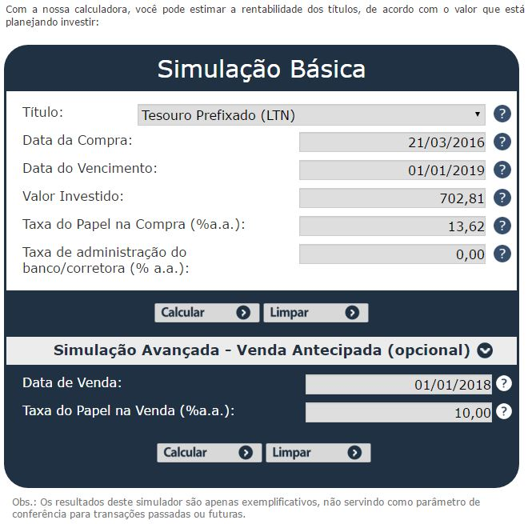
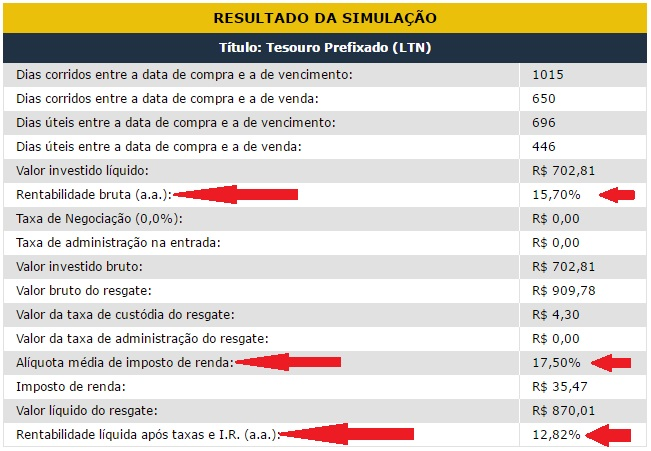

# Tesouro Direto: O que acontece se vender antes do vencimento?

***ATENÇÃO!** Os dados deste post são referentes ao início de 2016. Mas o pensamento permanece sendo o mesmo.*

Uma resposta eu já posso te adiantar: Nada garante que você vai receber a taxa que te foi prometida quando comprou o título. Vai depender. Do que vai depender, é o que eu vou te explicar agora.

Vou usar de exemplo o *Tesouro Prefixado*, que é o título mais fácil pra te mostrar as contas. Apesar dos títulos terem formatos diferentes, como visto no capítulo anterior, e as contas não serem iguais, a intuição é sempre a mesma: e quando você pega essa manha, tudo fica mais fácil.

Mas antes de tudo…

# O que são juros?

Essa pergunta tem algumas respostas. Mas cá pra nós, serve essa daqui:

**É a remuneração do seu capital.**

Ou seja, no nosso caso dos títulos públicos, é quanto o governo federal vai te recompensar por emprestar dinheiro pra ele.

Assim, nós temos:

**Preço + Juros = Valor de Face**

**Preço** = o preço que você pagou pelo título. Foi o seu capital investido.

**Juros** = é a remuneração pelo que você investiu.

**Valor de face** = é quanto o título paga no vencimento. É o total que você recebe no fim. Tudão. É o governo te devolvendo o dinheiro que você emprestou mais os juros. No caso do nosso Tesouro Prefixado, ele **sempre devolve R$ 1.000,00 no vencimento**.

Num gráfico, um exemplo (Valor de Face = R$ 1.000):

Assim, veja que:

**Quanto maiores os juros, menor o preço do título!**

E vice versa. Dizemos que os juros e preços são *inversamente relacionados*. Guarde bem essa relação, você vai usá-la daqui a pouco.

# Taxa de juros – para Nerds

Pra quem gosta de matemática, essa é a relação entre Preço e taxa de juros do título:

**Preço:** Preço do título

**VN:** Valor Nominal do título na data de vencimento = Valor de Face  = no nosso caso do Tesouro Prefixado, são R$ 1.000

**DU:** Dias úteis entre a data de liquidação (costuma ser 2 dias após a compra) e a data de vencimento (ou data de venda)

**Taxa:** Taxa de juros do título, xx% ao ano.

**Por que esse “252” aí?** Porque usam-se dias úteis para fazer as contas dos juros. (Um ano tem 252 dias úteis).

# O mercado de títulos públicos

Imagine que você já comprou o título. Como qualquer outra coisa que você compre, agora ele é seu. Você é o dono daquele título, e pode decidir vendê-lo para quem quiser.

Imagine que você comprou o título a  R$ 700, mas 1 dia depois você quer se desfazer dele.

Você pode vendê-lo para alguém a R$1 (mas não seria um bom negócio pra você).

Você poderia tentar vendê-lo a R$2.000 (mas acho que ninguém vai querer comprar de você).

Você pode inclusive tentar vendê-lo a um *preço justo*, mas se não encontrar ninguém que queira um título público, você vai ficar com ele encalhado na sua mão.

Mas… seus problemas acabaram! Felizmente existe um mercado (um lugar na internet) onde as pessoas podem comprar e vender seus títulos públicos, todos os dias. E esse mercado é, justamente, o Tesouro Direto.

Nesse mercado, porém, há uma “pessoa” que se destaca. Ela é tão grande, mas tão grande, que pode praticamente controlar o preço dos títulos, e decidir quando o mercado abre ou fecha. Essa “pessoa” é, obviamente, o **Governo Federal** (por meio do Tesouro Nacional).

Assim, nós, investidores pessoa física, tomamos os preços como dados. Não somos grandes o suficiente pra conseguir interferir nos preços. Simplesmente aceitamos o que está lá no site e pronto.

Enfim, para comprar ou vender títulos, basta acessar o site da sua corretora!

# O Preço muda!

Quando você acessar esse mercado, você verá o preço pelo qual pode vender os seus títulos. E é aí que vem o grande fato que motiva todo esse texto: **o preço do título muda!** 

A conjuntura econômica pode se alterar, os economistas do banco central podem decidir por uma mudança nos juros, e tudo isso pode impactar as decisões de compradores e vendedores nesse mercado. E assim, as taxas de juros (ou os preços dos títulos, tanto faz) mudam.

Além disso, no caso do nosso título pré-fixado, quanto mais próximo do vencimento, maior o preço do título. Faz sentido, né? O título não chega em R$1000,00 de um dia pro outro.

Veja, por exemplo, a evolução dos preços do Tesouro Prefixado 2019 no ano de 2016:

O preço de um título cresce com o tempo

# Calculadora **do Tesouro Direto**

Para calcular o quanto você ganharia com o Título, inclusive na venda antecipada, o próprio site do Tesouro disponibiliza uma calculadora para você. Dá só uma olhada:

**[Calculadora do Tesouro Direto (clique aqui)](https://www.tesourodireto.com.br/titulos/calculadora.htm)**

É só preencher os campos (por exemplo):

E conferir os resultados:

# Simulação de Venda Antecipada de Título do Tesouro Direto

Dizem por aí que vender o título antes do vencimento é sempre um mau negócio. Não é verdade. Como eu já falei, **depende**.

Vou usar aqui como exemplo o Tesouro Prefixado com vencimento em 01/01/2025. Imagine que você o comprou a R$ 533,43.

Caso leve esse título até o vencimento, você vai ganhar:

**Rentabilidade Bruta:** 10,67% ao ano (foi o combinado desde o início…)

**Imposto de Renda:** 15% (**clique aqui para saber porque 15%**)

**Rentabilidade Líquida** (ou seja, descontando taxas e imposto de renda): 9,15% ao ano.

Para achar essas rentabilidades, usei a **[calculadora do Tesouro Direto.](https://www.tesourodireto.com.br/titulos/calculadora.htm)**

Agora imagine que é 01/01/2020 e você decide vender antecipadamente (faltam ainda 5 anos para o título vencer).

# Cenário A – Queda da taxa de juros

Nesse caso, suponha que a taxa de juros do Tesouro Prefixado 2025 desceu para 9%. A **[calculadora do Tesouro Direto](https://www.tesourodireto.com.br/titulos/calculadora.htm)** nos dá:

**Rentabilidade Bruta:** 17,8% ao ano.

**Imposto de Renda:** 17,5%. (**clique aqui para saber porque 17,5%**)

**Rentabilidade Líquida** (ou seja, descontando taxas e imposto de renda): 14,46% ao ano.

Opa! Espera… 14,46% ao ano é maior do que 9,15% ao ano! Olha a oportunidade aí. Se você vender agora, vai ganhar uma taxa melhor do a que ganharia se levasse o título até o fim.

# Cenário B – Alta da taxa de juros

Agora vamos para o cenário de alta, que é o mais provável nos próximos anos. Suponha que a taxa de juros do Tesouro Prefixado 2025 subiu para 12%. A **[calculadora do Tesouro Direto](https://www.tesourodireto.com.br/titulos/calculadora.htm)** nos dá:

**Rentabilidade Bruta:** 5,38% ao ano.

**Imposto de Renda:** 17,5%. (**[clique aqui para saber porque 17,5%](/guia/investimentos/renda-fixa/todos-os-custos-do-tesouro-direto.html#_1-imposto-de-renda)**)

**Rentabilidade Líquida** (ou seja, descontando taxas e imposto de renda): 4,19% ao ano.

Agora a coisa não ficou boa. 4,19% é menor do que 9,15%. Ou seja, não vale a pena vender. Fique com esse título aí no bolso mesmo: aguarda o vencimento, ou aguarde os juros abaixarem.

Repare que nesse caso você não chegou a perder dinheiro. Você continuou ganhando, só que vale mais a pena segurar o título até o fim. Vender o título agora significaria abrir mão de uma taxa de 9,15% para ganhar uma taxa de 4,19% no lugar. (Lembra do **custo de oportunidade**?)

Se você tiver curiosidade, teste algumas taxas lá na calculadora! Existe alguma taxa para a qual você chega a ter prejuízo de verdade? O que acontece com o preço do título ou com seus ganhos quando a taxa de juros permanece inalterada (10,67% a.a.)?