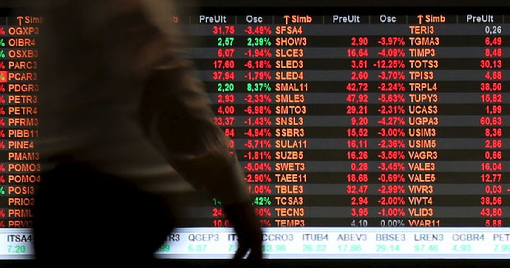

# As ações da Bolsa de Valores

Neste capítulo vou te mostrar as empresas que estão na **bolsa de valores**: são as **Sociedades Anônimas (ou S.A.)**. No próximo, vou te falar das 2 formas de ganhar dinheiro com elas (que afinal de contas, é o que todos queremos saber). E no outro, vou te mostrar na prática como comprar uma ação no site de uma corretora.

Então vamos lá:

# O que é uma Sociedade Anônima (S.A.)?

No capítulo sobre **[o que são ações](/guia/investimentos/conceitos-fundamentais/o-que-sao-acoes-o-que-e-uma-empresa.html),** eu expliquei o que é uma empresa.

Naqueles exemplos, todos os sócios se conheciam e se juntaram para fazer uma empresa: você tinha parte das ações e seus outros amigos tinham mais uma parte. Bem simples. Eram sociedades **limitadas**.

Ora, as empresas negociadas na bolsa de valores também são formadas por um conjunto de sócios. Porém, elas têm 2 importantes detalhes:

- Elas são bem grandes, compostas por várias ações.
- Assim, elas possuem váaaaarios sócios. E a maioria deles não se conhece, e nem precisa.

Por isso, elas são classificadas como **Sociedades Anônimas de Capital Aberto** em bolsa. Para ser sócio dessas empresas não é necessário “pedir para entrar”. Basta ir na bolsa de valores e comprar umas ações.

Enfim, é isso que a gente negocia na bolsa: ações de empresas S.A..

# E quem são elas?

*BRFS3: Empresa dona das marcas Sadia e Perdigão. Cotação em 22/11: R$ 22.*

Já pensou em ser sócio do megainvestidor Jorge Paulo Lemann? Você pode, basta comprar algumas ações da Ambev (a empresa que faz cerveja).

Já pensou em ser sócio do Governo Federal? Você pode, basta comprar algumas ações do Banco do Brasil ou Petrobrás, que são empresas estatais.

Sócio de Universidade? Tem COGNA, Estácio, Anima…

Bancos? Itaú, Bradesco, Santander…

Varejista? Magazine Luiza, Renner…

Farmácia? Raia Drogasil…

Come frango? BRF…

Aqui na bolsa brasileira você tem 500 opções dentre mineradoras, petroleiras, aviões, shoppings, roupas, calçados, supermercados, bancos, tecnológicas, telefônicas, agropecuárias, educacionais, energia elétrica… Elas podem ser vistas **[clicando aqui](http://www.b3.com.br/pt_br/produtos-e-servicos/negociacao/renda-variavel/acoes/consultas/classificacao-setorial/)**.

As mais negociadas, no entanto, tem um número muito mais reduzido e compõem um seleto grupo de principais ações da bolsa. Elas constituem o índice Ibovespa e podem ser vistas **[clicando aqui](http://www.b3.com.br/pt_br/market-data-e-indices/indices/indices-amplos/indice-ibovespa-ibovespa-composicao-da-carteira.htm)**. Atualmente, esse grupo é composto por 61 ações.

E quem é que vai te ajudar a escolher uma delas? Os relatórios de análise das corretoras, casas de análise independentes, gestores e planejadores financeiros.

# Os nomes das ações

Diferentemente de comprar chuchu na feira, os nomes das ações são padronizados. E o padrão é o seguinte:

:::center
**NOMEX**

– 4 letras e um número –
:::

“NOME” = é uma sigla de 4 letras para o nome da empresa.

“X” = é um número que indica o *tipo* da ação.

Veja alguns exemplos:

:::center

| **Código** |      **Ação**     | **Tipo** |
|:----------:|:-----------------:|:--------:|
|    ABEV3   |       AMBEV       |    ON    |
|    B3SA3   |         B3        |    ON    |
|    BBAS3   |  BANCO DO BRASIL  |    ON    |
|    BBDC3   |      BRADESCO     |    ON    |
|    BBDC4   |      BRADESCO     |    PN    |
|    BRFS3   |       BRF SA      |    ON    |
|    CCRO3   |       CCR SA      |    ON    |
|    CIEL3   |       CIELO       |    ON    |
|    CMIG4   |       CEMIG       |    PN    |
|    CPLE6   |       COPEL       |    PNB   |
|    CVCB3   |     CVC BRASIL    |    ON    |
|    CYRE3   |    CYRELA REALT   |    ON    |
|    ECOR3   |    ECORODOVIAS    |    ON    |
|    EGIE3   |    ENGIE BRASIL   |    ON    |
|    ELET3   |     ELETROBRAS    |    ON    |
|    ELET6   |     ELETROBRAS    |    PNB   |
|    EMBR3   |      EMBRAER      |    ON    |
|    ENBR3   |    ENERGIAS BR    |    ON    |
|    EQTL3   |     EQUATORIAL    |    ON    |
|    ESTC3   |    ESTACIO PART   |    ON    |
|    FIBR3   |       FIBRIA      |    ON    |
|    FLRY3   |       FLEURY      |    ON    |
|    GGBR4   |       GERDAU      |    PN    |
|    GOAU4   |     GERDAU MET    |    PN    |
|    GOLL4   |        GOL        |    PN    |
|    IGTA3   |      IGUATEMI     |    ON    |
|    ITSA4   |       ITAUSA      |    PN    |
|    ITUB4   |    ITAUUNIBANCO   |    PN    |
|    JBSS3   |        JBS        |    ON    |
|   KLBN11   |     KLABIN S/A    |    UNT   |
|    COGN3   |       COGNA      |    ON    |
|    LAME4   |    LOJAS AMERIC   |    PN    |
|    LREN3   |    LOJAS RENNER   |    ON    |
|    MGLU3   |   MAGAZINE LUIZA  |    ON    |
|    MRVE3   |        MRV        |    ON    |
|    NATU3   |       NATURA      |    ON    |
|    PCAR4   |    P.ACUCAR-CBD   |    PN    |
|    PETR3   |     PETROBRAS     |    ON    |
|    PETR4   |     PETROBRAS     |    PN    |
|    QUAL3   |     QUALICORP     |    ON    |
|    RADL3   |   RAIA DROGASIL   |    ON    |
|    RAIL3   |     RUMO S.A.     |    ON    |
|    RENT3   |      LOCALIZA     |    ON    |
|   SANB11   |    SANTANDER BR   |    UNT   |
|    SBSP3   |       SABESP      |    ON    |
|    SMLS3   |       SMILES      |    ON    |
|    SUZB3   |    SUZANO PAPEL   |    ON    |
|   TAEE11   |       TAESA       |    UNT   |
|    TIMP3   |    TIM PART S/A   |    ON    |
|    UGPA3   |      ULTRAPAR     |    ON    |
|    USIM5   |      USIMINAS     |    PNA   |
|    VALE3   |        VALE       |    ON    |
|    VIVT3   | TELEFÔNICA BRASIL |    ON    |
|    VVAR3   |     VIAVAREJO     |    ON    |
|    WEGE3   |        WEG        |    ON    |

:::

O número funciona da seguinte forma:

- Ação Ordinária (ON): 3
- Ação Preferencial (PN): 4
- Ações Preferenciais de classes A, B, C ou D (PN A, B, C ou D): 5, 6, 7, 8, respectivamente.
- Units: 11

Ação Ordinária: É aquela que dá direito a voto nas assembleias da empresa.

Ação Preferencial: Não dá direito a voto nas assembleias, mas dá **preferência** no recebimento de dividendos. Por isso, se uma empresa tem ações preferenciais, geralmente essas são mais negociadas do que as ordinárias (as pessoas preferem dividendos do que direito de voto).

Preferenciais de classes: Essas ações são preferenciais, como quaisquer outras, mas se diferenciam por regras específicas de estatuto de cada empresa. São bem mais raras de se ver.

Units: são pacotes que combinam ações ordinárias e preferenciais de uma empresa. São mais raros de se ver.

Uma empresa pode ter apenas ações Ordinárias, sem problemas. Assim, todos os acionistas têm os mesmos direitos de voto e dividendos (de acordo com sua proporção acionária, é claro).

Agora **finalmente** você entende o que se passa nesse tipo de imagem:

*Um painel de cotações da Bolsa de Valores (B3)*

# Até semana que vem!

O post de hoje foi uma janela: te mostrei o que há por aí.

Na semana que vem nós vamos ao que interessa: **Como ganhar dinheiro na bolsa?**

Vou te mostrar as duas formas em que você pode ganhar dinheiro com ações. Não existe fórmula mágica, mas você vai entender como a coisa funciona!

Dúvidas? Sugestões? Curiosidades? Dá um alô aí nos comentários!

Um abraço e até mais!