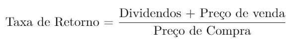
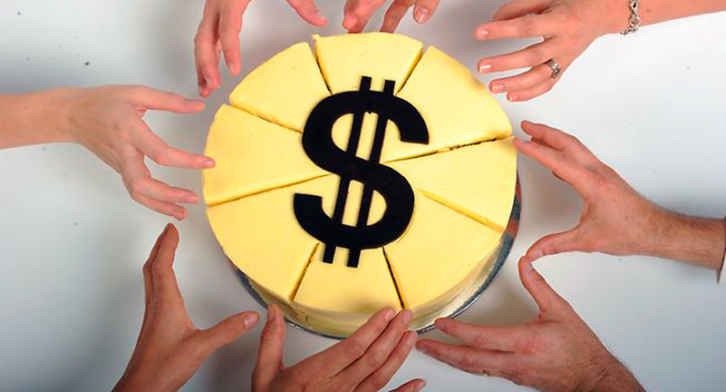
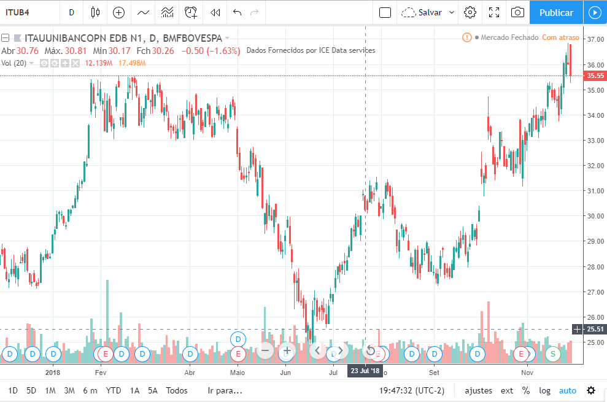
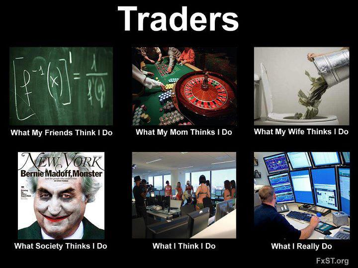

# Como ganhar dinheiro com ações? – Dividendos e Trades

No último capítulo te mostrei algumas empresas que você pode comprar na Bolsa de Valores, e agora vou te mostrar como que se ganha dinheiro com ações.

O que eu vou te mostrar hoje são dois conceitos básicos que você **deve** saber antes de navegar no mundo das ações: **dividendos** e **especulação**.

Em outras palavras: você quer ser *sócio* ou *trader*?

Depois de responder a essa questão, você poderá definir seus objetivos e investir com mais tranquilidade.

Vamos lá:

# Taxa de retorno de uma ação

Essa fórmula sintetiza tudo: você pode ganhar dinheiro de duas formas. Pelos dividendos que você recebe ao longo do tempo e pelo preço que você vende a sua ação. Vamos ver cada uma dessas duas formas em detalhes.

# Ganhando dinheiro com ações #1: Dividendos

O conceito é simples: se você é dono de uma ação, você é dono de parte da empresa. E se você é dono de parte da empresa, você merece uma parte do lucro.

Essa parte do lucro que você recebe é o que chamamos de **dividendos**.

Veja, por exemplo, as ações do maior banco da América Latina: o Itaú. Imagine que você comprou 100 ações do Itau (ITUB4) num dos últimos pregões de 2017: dia 26 de dezembro. A cotação dela, nesse dia, era de **R$ 42,70**. Ou seja, você gastou **R$ 4.270**.

Em 2018, a empresa distribuiu os seguintes dividendos aos seus acionistas:

| **Data de Pagamento** |  **Tipo de Provento**  | **Valor por Ação** |
|:---------------------:|:----------------------:|:------------------:|
|       03/12/2018      |        Dividendo       |       0,0150       |
|       01/11/2018      |        Dividendo       |       0,0150       |
|       01/10/2018      |        Dividendo       |       0,0150       |
|       03/09/2018      |        Dividendo       |       0,0150       |
|       30/08/2018      | Dividendo Complementar |       0,6240       |
|       30/08/2018      |           JCP          |       0,1064       |
|       01/08/2018      |        Dividendo       |       0,0150       |
|       02/07/2018      |        Dividendo       |       0,0150       |
|       01/06/2018      |        Dividendo       |       0,0150       |
|       02/05/2018      |        Dividendo       |       0,0150       |
|       02/04/2018      |        Dividendo       |       0,0150       |
|       07/03/2018      |    JCP Complementar    |       0,9765       |
|       07/03/2018      | Dividendo Complementar |       0,9638       |
|       07/03/2018      |        Dividendo       |       0,1304       |
|       01/03/2018      |        Dividendo       |       0,0150       |
|       01/02/2018      |        Dividendo       |       0,0150       |
|                       |                        |**Soma: 2,9661**    |

Fonte: **[Relações com Investidores – Itaú](https://www.itau.com.br/relacoes-com-investidores/show.aspx?idCanal=S+VEtYmxJ2VmuWh139PoGw==)**

O que dá uma soma de R$ 2,9661 por ação. Como você comprou 100 ações, teria ganho ao todo **R$ 296,61**.

Logo, a taxa de retorno foi de 296,61/4270 = **6,9% em um ano**. **Apenas com os dividendos**.

A gente nem chegou a olhar se o preço da ação subiu, se desceu…

E a boa notícia é que, no caso do Itaú, esses dividendos mantiveram um bom crescimento nos últimos anos. Olha só:

| **Ano** | **Dividendo por Ação** | **Crescimento sobre o ano anterior** |
|:-------:|:----------------------:|:------------------------------------:|
|   2017  |         R$2,71         |                71,52%                |
|   2016  |         R$1,58         |                27,42%                |
|   2015  |         R$1,24         |                 1,64%                |
|   2014  |         R$1,22         |                18,45%                |
|   2013  |         R$1,03         |                 3,00%                |
|   2012  |         R$1,00         |                 3,09%                |
|   2011  |         R$0,97         |                12,79%                |
|   2010  |         R$0,86         |                 8,86%                |
|   2009  |         R$0,79         |                   –                  |

Fonte: **[RI – Itaú](https://www.itau.com.br/relacoes-com-investidores/show.aspx?idCanal=S+VEtYmxJ2VmuWh139PoGw==)**

Além disso, ainda houve algumas bonificações em ações no meio do caminho: ou seja, o número de ações aumentou sem você fazer nada. E com isso, mais dividendos na conta.

Se a empresa continuar crescendo, seus dividendos também continuam crescendo.

Moral da história: Quem está investindo em dividendos compra, aguarda o dinheiro entrar na conta, e torce pra empresa continuar dando bons lucros e crescendo. O foco está no longo prazo.

# Riscos da Estratégia de Dividendos

Investir em ações é um exercício de tentar prever o futuro. Se você vê que a empresa é bem gerida, tem projetos inovadores, preza pela eficiência, parece que conseguirá cortar custos e aumentar receitas, então o futuro parece ser bom, e você provavelmente vai ganhar bons dividendos.

Agora, se a administração da empresa for nebulosa, se as informações ao investidor forem ruins, se o mercado dessa empresa tiver uma má perspectiva para o futuro, se os grandes sócios majoritários estiverem brigando ou estiverem colocando a política na frente dos negócios,  ou ainda se simplesmente a empresa está sendo superada por concorrentes mais eficientes, cuidado! Pode ser que seja hora de reavaliar seus investimentos, vender suas ações e comprar outra empresa.

# Importante: NÃO SE APEGUE!

Esse é um erro básico, que já presenciei muitas de vezes: o investidor comprou uma ação há 20 anos, que era uma maravilha na época! A empresa já lhe deu muitas alegrias e gordos dividendos.

O investidor cria afeto por aquela empresa.

Agora os tempos mudaram e a empresa está começando a cair. As perspectivas para os próximos anos vão de mal a pior. Mas ele insiste em pensar ao contrário de tooooodo o mercado e – de forma surpreendentemente otimista – decide se manter com a ação na carteira aguardando por dias melhores.

Com tudo indicando contra, ele permanece achando que “o papel vai voltar”, e pra piorar a situação, ele compra ainda mais, sob o argumento de que “ficou barato”.

Quando tudo aponta que pode ficar mais barato ainda.

Lembre-se que o que está ali não é apenas uma ação. É, antes de tudo, o seu dinheiro. E ele tem que estar no melhor lugar possível.

# Ganhando dinheiro com ações #2: Valorização da Ação

O outro jeito de ganhar dinheiro com ações é com a **especulação** sobre o preço da ação. Esse nome – especulação – às vezes têm uma carga negativa, mas é simplesmente você torcendo pro preço da ação jogar ao seu favor.

O pensamento é simples: **comprar barato** agora para **vender mais caro** depois. Acabou.

Mas para fazer boas escolhas, você vai ter que investir tempo pra aprender sobre o assunto e pra operar no mercado.

Então a grande pergunta aí é: como saber se a ação **vai subir ou descer**?

É impossível responder essa pergunta num capítulo só. Mas vou te dar uma introdução, e te mostrar as principais formas de analisar a situação:

# Os tipos de análise de ações

**Análise Fundamentalista:** É a análise que olha qual o preço justo de uma empresa. Isso é visto analisando no que a empresa gasta, como ela ganha dinheiro, quais suas estratégias, seus investimentos, como está seu endividamento. É a análise que tenta entender o negócio em que a empresa está, inclusive olhando a concorrência e o cenário econômico. Ela serve para analisar cenários mais longos, inclusive se você está de olho nos dividendos.

**Análise Gráfica:** Olha esse gráfico bonitão aí embaixo. Todo coloridão, cheio de barras verdes e vermelhas. Ele conta a história de ITUB4 em 2018, e é pra isso que o analista gráfico olha. Ele não quer saber se a empresa vende sapatos, cerveja, frangos ou petróleo. Ele não precisa nem saber o nome da empresa. O objetivo da análise gráfica é buscar padrões que possam se repetir no gráfico e indicar qual o próximo movimento da ação. Ele busca, por esses desenhos, entender os movimentos dos compradores e vendedores. É uma análise bastante usada para fazer operações de curto prazo. Inclusive se você quiser comprar e vender no mesmo dia! (O que chamamos de *daytrade*).

**Análise Técnica:** Tal qual a análise gráfica, o analista técnico não liga muito pro que a empresa faz. O que importa para ele é ver o movimento dos preços. Assim, esse analista é, antes de tudo, um estatístico. Ele tenta usar modelos matemáticos, médias, índices de força, para tentar prever os próximos movimentos dos preços. Ele analisa toda a série de preços e, por meio da teoria da probabilidade, estatística ou econometria, chega a conclusões sobre os mais prováveis movimentos de uma ação. Também é uma boa forma de ver as coisas no curto prazo.

# Riscos da especulação sobre a valorização da ação

Volatilidade é a palavra. Se um preço varia muito num espaço de tempo, a gente diz que essa coisa é muito volátil. Se o preço fica ali paradão, sem muitas emoções, dizemos que a coisa tem baixa volatilidade.

Ela não é má, ela só aumenta o seu risco. Ou seja: suas chances de perder aumentam, mas suas chances de ganhar também.

E essa volatilidade é influenciada por uma série de fatores: o clima político do país, preço de *commodities* internacionais (como petróleo e ferro), cenário econômico, decisões de última hora tomadas pela empresa, decisões do banco central, divulgação de resultados acima ou abaixo do esperado, boatos, bolhas…

O ponto aqui é que os riscos podem ser substancialmente maiores, e o investidor deve estar atento a alguns pontos:

- traçar uma estratégia inicial e respeitá-la, para não ser levado pela emoção do momento
- estar atento às oportunidades e selecionar boas fontes de informação
- desconfiar das soluções milagrosas
- investir aquilo que ele sabe que pode perder. O trader deve ter também outras reservas mais conservadoras (por exemplo, a reserva para emergências).

# Dividendos x Especulação

Lembra dos nossos dividendos de ITUB4 no primeiro exemplo?

Você investiu R$ 4.270 e ganhou R$296,71 em dividendos

E quanto ganharia se, além dos dividendos, tivesse vendido suas ações agora no fim do ano?

Se você segurasse as ações até agora, ganharia uma bonificação de 50% no número de ações. Ou seja, teria agora 150 ações. Cada uma valendo R$ 36 (dado de 03/12/18).

Ou seja, suas ações valeriam 150 x 36 = **R$ 5400**.

R$ 5400 (venda) – R$ 4270 (compra) = **R$ 1130** (lucro com a valorização da ação).

1130/4270 = 26,5%

Resumindo:

Ganho de 26% com a valorização da ação

mais 7% de ganho com os dividendos

igual a **33% de valorização do seu patrimônio em um ano**.

Nada mal, né?

Agora fica a pergunta: será que vai continuar assim nos próximos anos?

# Partindo pra prática!

Agora você já viu o básico da filosofia por trás das ações. No próximo capítulo vou comprar uma ação no site de uma corretora.

Dúvidas? Sugestões? Curiosidades? Dá um alô aí nos comentários!

**Observação: Rentabilidades passadas não garantem ganhos futuros.**